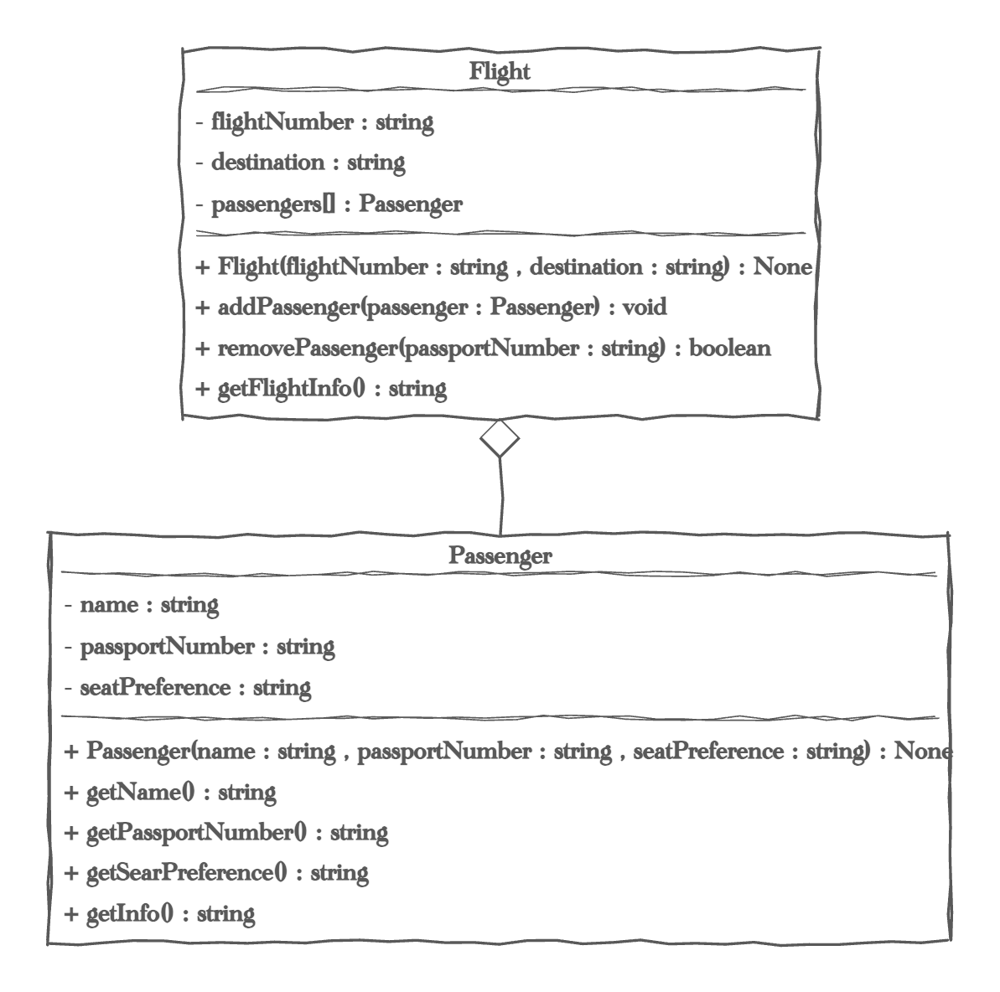

# Aggregation Exercise: Flight Management System

## Overview
In this exercise, you will design a simple C++ program that models a flight management system. The system will consist of two classes: `Passenger` and `Flight`.

- The `Passenger` class will represent a passenger with attributes like their name, passport number, and seat preference.
- The `Flight` class will manage a collection of passengers and allow adding or removing passengers from a flight.

This exercise will help you understand:
- Object-oriented programming concepts like aggregation.
- How to design and implement C++ classes that interact with each other.

## Learning Objectives
By the end of this exercise, you will be able to:
- Understand and implement classes that use pointers to represent aggregation relationships.
- Understand the relationship between objects and how classes can manage collections of other objects.

## Grading rubric 30 points
| Points | Requirements                           |
|--------|----------------------------------------|
| 10     | Product Base Class (auto-graded)       |
| 10     | Electronic Derived Class (auto-graded) |
| 10     | Style and Drivers  (hand-graded)       |

## Exercise Instructions
1. **Implement the `Passenger` Class**:
    - Open `Passenger.h` and `Passenger.cpp` and complete the implementation.
    - The `Passenger` class should have the following:
        - Attributes: `name`, `passportNumber`, and `seatPreference`.
        - A constructor to initialize a `Passenger` object.
        - Getter methods for each attribute.
        - A method `getInfo()` that returns a formatted string with all passenger details.
        - 
2. **Test the Passenger Class**:
    - Open `:PassengerDriver.cpp` and modify it to create several `Passenger` objects.
    - Show that the constructor works creating multiple passengers 
    - Show the getters work by accessing each and printing the results.
    - Demonstrate the getInfo() method

3. **Implement the `Flight` Class**:
    - Open `Flight.h` and `Flight.cpp` and complete the implementation.
    - The `Flight` class should manage a collection of pointers to `Passenger` objects. This will represent an aggregation relationship.
    - The `Flight` class should have the following:
        - Attributes: `flightNumber`, `destination`, and a `std::vector` of pointers to `Passenger`.
        - A constructor to initialize a `Flight` object.
        - Methods to add a `Passenger` to the flight, remove a `Passenger` by their passport number, and get a list of all passengers on the flight.

4. **Test the FlightDriver**:
    - Open `FlightDriver.cpp` and modify it to create several `Passenger` objects and add them to different flights.
    - Simulate scenarios such as:
        - Adding passengers to a flight.
        - Removing a passenger from a flight.
        - Displaying information about all passengers on a flight.
        - Transferring a passenger from one flight to another.

5. **Clean Up Memory**:
    - Ensure that you properly `delete` any dynamically allocated memory for `Passenger` or `Flight` objects in `main` to prevent memory leaks.
   
6. **Document your code**:
   - Make you your code has documenting comments for all classes and methods.
   
7. **Turn it in**:
   - commit and push all your work
   - turn in the repository URL on canvas 